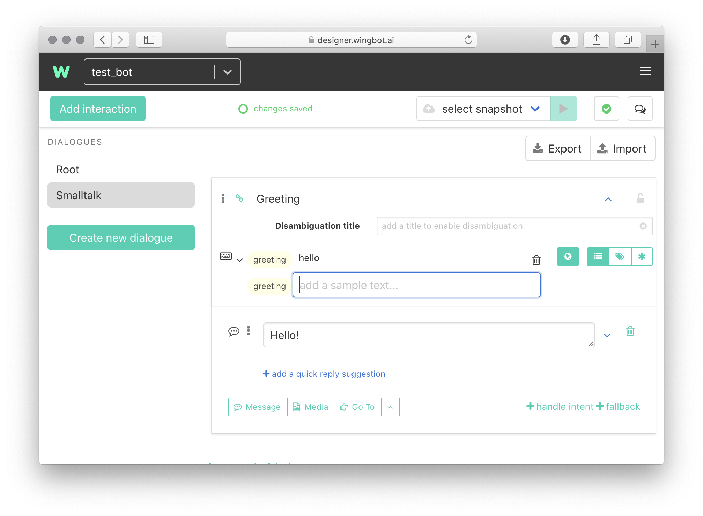
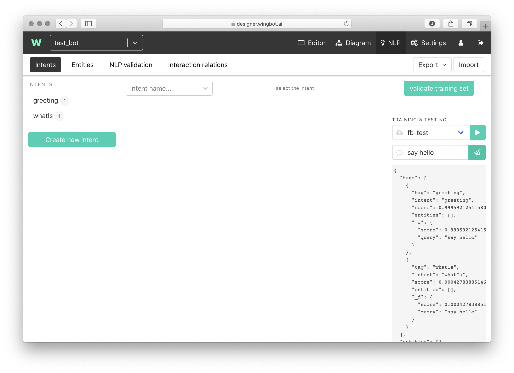
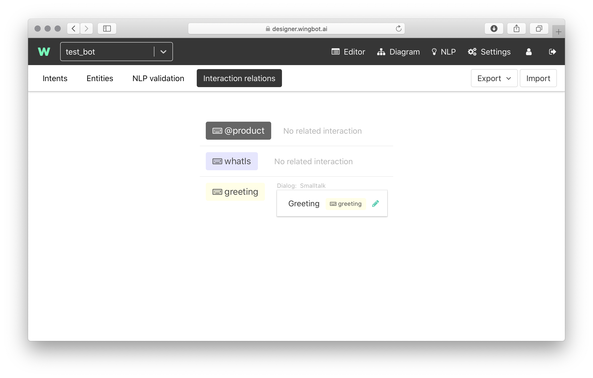

# Advanced NLP: training data building

## Avoid missleading intent names

Keeping the intent name understandable is a part of success. **There's always someone, who'll continue in your work.**

**bad**

```yaml
# (intent: utterance)
advice: how much make a chatbot
advice: how to build a bot
duration: how much time it takes to build a bot
duration: how does it take to make a chatbot
long: how long the message should be
long: what is the best length of text message
```

Also categorization of intents helps a lot.

**good**

```yaml
# (intent: utterance)
faq-howToMakeBot: how much make a chatbot
faq-howToMakeBot: how to build a bot
faq-buildDuration: how much time it takes to build a bot
faq-buildDuration: how does it take to make a chatbot
conversation-bestTextLength: how long the message should be
conversation-bestTextLength: what is the best length of text message
```

## Avoid general intents

Putting all utterances which leads into the same answer under a same intent is a very common mistake.

**bad**

```yaml
# (intent: utterance)
aboutCats: how much a cat eats
aboutCats: how much food a cat consumes
aboutCats: how much a cat weights
aboutCats: how many kilos a cat has
```

**good**

```yaml
# (intent: utterance)
howMuchCatEats: how much a cat eats
howMuchCatEats: how much food a cat consumes
howMuchCatWeights: how much a cat weights
howMuchCatWeights: how many kilos a cat has
```

## Try to mix long and short utterances

Some people are more expressive, some not. Make the NLP usable for the both groups.

**bad**

```yaml
# (intent: utterance)
howMuchCatEats: how much a cat eats
howMuchCatEats: how much food a cat consumes
howMuchCatEats: what quantity of food the cat eats
howMuchCatWeights: cat weight
howMuchCatWeights: cat kilos
```

**good**

```yaml
# (intent: utterance)
howMuchCatEats: how much a cat eats
howMuchCatEats: how much food a cat consumes
howMuchCatEats: what quantity of food the cat eats
howMuchCatEats: cat food quantity
howMuchCatEats: cat food consupmtion
howMuchCatWeights: how much a cat weights
howMuchCatWeights: how many kilos a cat has
howMuchCatWeights: cat weight
howMuchCatWeights: cat kilos
```

## Avoid missleading words in intent utterances

Misleading words in combination with a disproportion between intents results in suprising false-positive intent recognition.

**bad**

```yaml
# (intent: utterance)
whatTimeIsIt: please tell me, what time is
whatTimeIsIt: hello, can you tell me, what time do you have
whatTimeIsIt: I`am wondering, what could be hours
whatTimeIsIt: where is my watch
whatTimeIsIt: oh no, I completely lost track of time
```

**good**

```yaml
# (intent: utterance)
whatTimeIsIt: what time is it
whatTimeIsIt: tell me, what time is
whatTimeIsIt: what time do you have
whatTimeIsIt: what could be hours
```

## Avoid disproportion between intents

Disproportions makes a single intent much more likely to be false-positive matched.

- all intents should have **similar number of utterances**
  - largest intent should have twice as many utterances than the smallest
  - good numbers of utterances are 6-12 for simple bots, 12-24 for more sophisticated bots
- **distribute common phrases over all intents**

**bad**

```yaml
# (intent: utterance)
whereIsATiger: where is a tiger
whereIsATiger: tiger where
whereIsFoodCourt: where can i find a foodcourt
whereIsFoodCourt: how to get to foodcourt
whereIsFoodCourt: where the food court is?
whereIsFoodCourt: where is a food court?
whereIsFoodCourt: foodcourt where?
```

**good**

```yaml
# (intent: utterance)
whereIsATiger: where is a tiger
whereIsATiger: tiger where
whereIsATiger: where can i find a tiger
whereIsATiger: how to get to tigers cage
whereIsATiger: where the tiger is
whereIsFoodCourt: where can i find a foodcourt
whereIsFoodCourt: how to get to foodcourt
whereIsFoodCourt: where the food court is
whereIsFoodCourt: where is a food court
whereIsFoodCourt: foodcourt where
```


## Solving a problem with lot of synonyms for a single meaning

If there is a word with many synonyms spread all around the bot's thraining data, it's good to identify the word soon and replace it with an entity.

**bad**

```yaml
# (intent: utterance)
whatIsCorona: what is a corona virus
whatIsCorona: what is a covid-19
whatIsCorona: more info about covid-19
treatment: how the virus is treated
treatment: how the covid19 is treated
treatment: treatment of corona
```

- by intoducing an entity called **@virus**, we can **simplify all training data**.
- the entity **does not need to be included in interaction conditions**


**good**

```yaml
# (@entity: value [synonyms, ...])
@virus: covid19 [corona virus, covid-19, corona, the virus, virus, covid virus]

# (intent: utterance)
whatIsCorona: what is a @virus
whatIsCorona: more info about @virus
treatment: how the @virus is treated
treatment: treatment of @virus
```

## Solving a problem with similar intents - Merging them

If there are many similar intents and

- the only difference is a meaning of single word
- the answer differs depending on that word

**bad**

```yaml
# (intent: utterance)
whatIsScrewdriver: what is a screwdriver
whatIsScrewdriver: tell me about screwdrivers
whatIsHammer: what is a hammer
whatIsHammer: tell me about hammers
whatIsWarranty: what is a warranty
whatIsWarranty: tell me about warranty
```

The solution is to **introduce an entity or more entities**

**good**

```yaml
# (@entity: value [synonyms, ...])
@product: screwdriver [screwdrivers, turnscrew, worm-screw]
          hammer [hammers]
@service: warranty [warranties, return policy]

# (intent: utterance)
whatIs: what is a @product
whatIs: what is the @product
whatIs: tell me about @product
```

And then you have to **use entity condition at each interaction**.


## Adding a new utterance or intent

Let's have a new utterance `say hello` and the bot now does not understand it.

1. **find an answer interaction, and check if there is already an intent**

    

    If the right interaction does not exist, you'll have to create it.

1. **if the intent exists, ensure your utterance is similar to other utterances**

    If the intent has a different meaning, but the answer is same - **add a new intent - the answer can be distinguished later.**

    

1. **use the NLP trainer to look for possible conflicting intents**

    There already can be an intent you're looking for. Scroll down on discover all matched intents.

    

1. **if there is a intent recognized, check the connected interaction is the answer for your question**

    


<style>
.hljs-attr { font-weight: bold; }
</style>